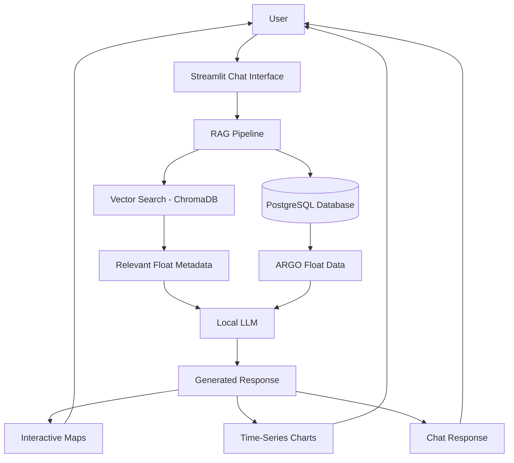

# 🌊 FloatChat – AI-Powered ARGO Data Explorer

A conversational AI application for exploring **ARGO oceanographic float data** using natural language. FloatChat combines a chatbot interface, semantic search, and interactive visualizations to help users query, analyze, and understand oceanographic datasets without writing SQL or complex data-processing code.

The application integrates Retrieval-Augmented Generation (RAG), vector search, and structured database queries to provide meaningful insights from ARGO float observations.

---

## 🌐 Overview

FloatChat enables users to:

- Explore ARGO float observations through natural language
- Visualize float locations on interactive maps
- Generate pressure and parameter time-series plots
- Retrieve relevant information using semantic search
- Interact with oceanographic datasets in a ChatGPT-style interface

---

## ✨ Features

- AI-powered conversational interface
- ChatGPT-style chat experience
- Floating chat input
- Interactive map visualization
- Pressure and ocean parameter plotting
- Retrieval-Augmented Generation (RAG)
- Semantic search using vector embeddings
- PostgreSQL-backed structured data retrieval
- Fast and intuitive data exploration

---

## 🏗️ System Architecture



---

## 🛠️ Technology Stack

### Frontend

- Streamlit
- HTML
- CSS

### Backend

- Python 3.x

### Database

- PostgreSQL
- ChromaDB

### AI & Machine Learning

- Retrieval-Augmented Generation (RAG)
- Flan-T5 / Local Large Language Model
- Vector Embeddings

### Data Visualization

- Plotly
- Leaflet

---

## 📊 Data Exploration

FloatChat enables users to analyze ARGO observations through conversational queries.

Users can:

- View ARGO float locations
- Explore pressure profiles
- Analyze temperature variations
- Compare salinity measurements
- Visualize parameter trends over time
- Search oceanographic metadata semantically

The combination of structured SQL retrieval and vector search provides accurate and context-aware responses.

---

## 💬 Conversational Interface

The application features a modern chatbot interface inspired by ChatGPT.

The assistant helps users:

- Search ARGO observations
- Generate visualizations
- Retrieve oceanographic information
- Understand float metadata
- Explore datasets using natural language

---

## 🧠 Retrieval-Augmented Generation (RAG)

FloatChat combines structured database queries with semantic search.

The workflow includes:

- User submits a natural language query
- ChromaDB retrieves semantically relevant metadata
- PostgreSQL provides structured ARGO observations
- Local LLM interprets retrieved context
- Final response is generated with supporting visualizations

This architecture enables accurate, context-aware exploration of oceanographic datasets.

---

## 🚀 Demo Queries

Try asking questions such as:

- Show the temperature and pressure profiles of ARGO floats near the equator.
- Compare salinity levels in the Arabian Sea and Bay of Bengal over the last six months.
- Find the nearest ARGO floats to latitude 10°N and longitude 75°E.
- Plot pressure versus depth for floats in the Indian Ocean.
- Show pressure trends of ARGO floats recorded during March 2023.

---

## ⚙️ Configuration

The application uses environment-based configuration for managing:

- PostgreSQL connection settings
- ChromaDB configuration
- LLM parameters
- Data paths
- Streamlit settings

This structure allows seamless deployment across development and production environments.

---

## 🚀 Running the Application

### Activate the Virtual Environment

```powershell
D:/my_project/venv/Scripts/Activate.ps1
```

### Start the Application

```powershell
cd D:\floatchat
streamlit run front_end/app.py
```

### Open in Browser

```
http://localhost:8501/
```

---

## 📁 Project Workflow

1. User enters a natural language query.
2. Streamlit sends the query to the backend.
3. ChromaDB performs semantic retrieval.
4. PostgreSQL fetches relevant ARGO observations.
5. The Local LLM generates a contextual response.
6. Interactive maps and charts are created when applicable.
7. Results are displayed within the chat interface.

---

## 📌 Notes

- Demo uses a subset of approximately 500 ARGO floats for improved performance.
- Designed as a proof-of-concept for oceanographic data exploration.
- Supports conversational querying with inline visualizations.
- Focused on Indian Ocean ARGO datasets.

---

## 🔮 Future Work

- Full global ARGO dataset integration
- Biogeochemical (BGC) ARGO support
- Satellite data integration
- Improved Retrieval-Augmented Generation pipeline
- Advanced filtering and analytics
- Enhanced UI/UX
- Multi-modal visualizations
- Support for additional Large Language Models

---

## 🎯 Project Scope

The primary objective of FloatChat is to demonstrate how conversational AI can simplify scientific data exploration.

The project focuses on:

- Conversational AI
- Retrieval-Augmented Generation
- Semantic search
- Database integration
- Interactive visualization
- Oceanographic data analytics
- Natural language interfaces for scientific datasets

---

## 🎓 Academic Purpose

FloatChat was developed as an AI-powered data exploration project to demonstrate:

- Retrieval-Augmented Generation (RAG)
- Vector database integration
- Natural language querying
- PostgreSQL data retrieval
- Interactive scientific visualization
- Conversational AI for domain-specific datasets

The project showcases how modern AI technologies can transform complex scientific datasets into intuitive, conversational experiences.

---

## 📜 License

This project is intended for educational, research, and learning purposes. Contributions, experimentation, and further development are encouraged.
